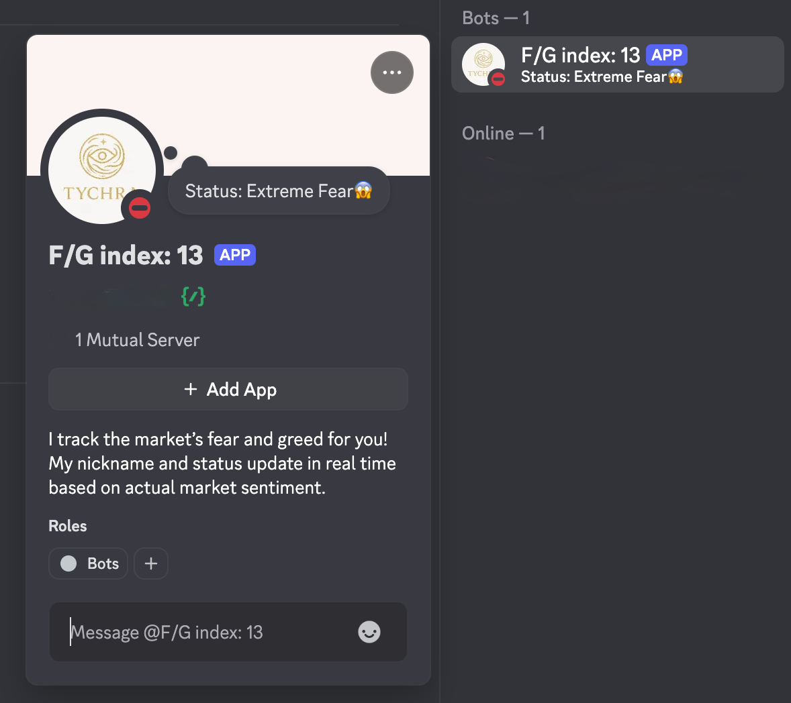
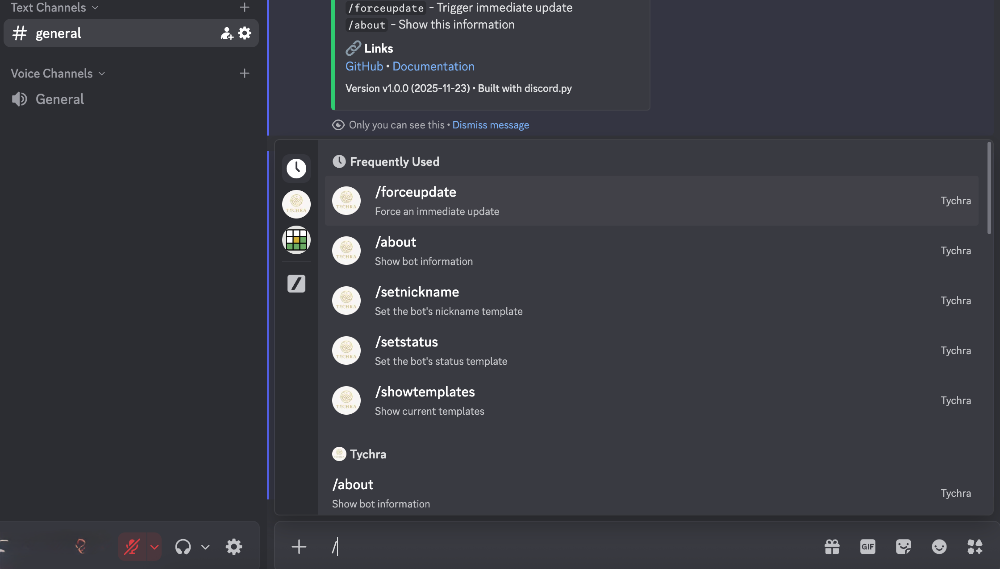
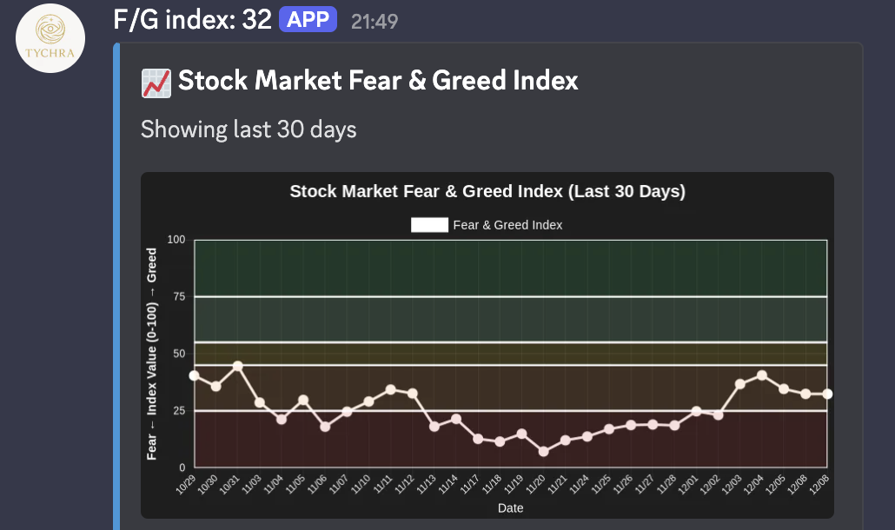
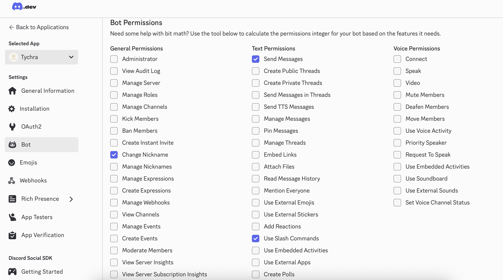
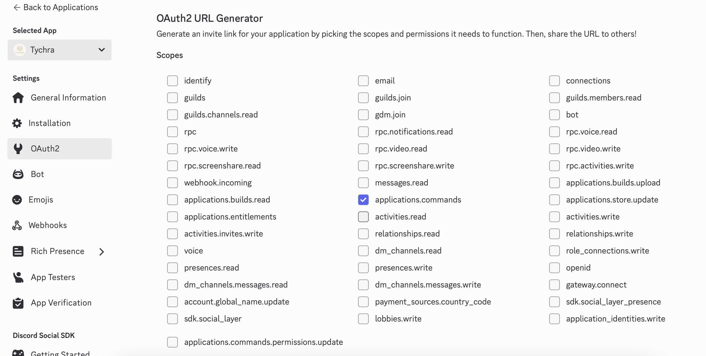

# Tychra

[](https://github.com/VikStoykov/Tychra/actions/workflows/release.yml)


<div align="center">
  
</div>

**A Discord bot that tracks market sentiment indicators and displays them in real-time**

---

## Features

- 📊 **Live Market Data** - Fetches CNN Fear & Greed Index automatically
- 💰 **Crypto Sentiment** - Tracks Crypto Fear & Greed Index from Alternative.me
- 🤖 **Dynamic Updates** - Changes bot nickname and status based on market sentiment
- ⏰ **Scheduled Updates** - Configurable automatic updates with timezone support
- 🎨 **Customizable Templates** - Create your own display format per server
- 📈 **Multiple Providers** - Combine stock and crypto data in one display
- 🐳 **Docker Ready** - Easy deployment with Docker and docker-compose
- 📊 **Historical Charts** - Visualize Fear & Greed trends over time with color-coded zones
- 🆓 **Free & Open Source** - No API keys required (uses public data)



## Quick Start

### Prerequisites

- Python 3.9+
- Discord Bot Token ([Get one here](https://discord.com/developers/applications))
- Docker (optional, for containerized deployment)

### Installation

[](https://github.com/VikStoykov/Tychra/releases/latest)


#### Option 1: Local Installation

```bash
# Clone the repository
git clone https://github.com/VikStoykov/Tychra.git
cd Tychra

# Create virtual environment
python3 -m venv bot-env
source bot-env/bin/activate  # On Windows: bot-env\Scripts\activate

# Install dependencies
pip install -r requirements.txt

# Configure environment
cp .env.example .env
# Edit .env and add your DISCORD_TOKEN

# Run the bot
python3 main.py
```

#### Option 2: Docker

```bash
# Pull the image
docker pull vikstoykov/tychra:latest

# Run with environment file
docker run -d \
  --name tychra-bot \
  --env-file .env \
  --restart unless-stopped \
  vikstoykov/tychra:latest
```

#### Option 3: Docker Compose

```bash
# Edit .env file with your settings
docker-compose up -d
```

## Configuration

Create a `.env` file with the following variables:

```env
# Required: Your Discord bot token
DISCORD_TOKEN=your_discord_bot_token_here

# Optional: Timezone for scheduled updates (default: UTC)
TIMEZONE=UTC

# Optional: Cron schedule for automatic updates (standard cron format)
# Format: "MINUTE HOUR DAY MONTH DAYOFWEEK"
SCHEDULE_CRON=0 9,18 * * *
```

### Schedule Examples

```env
# Every 5 minutes
SCHEDULE_CRON=*/5 * * * *

# Every day at 8:00 AM
SCHEDULE_CRON=0 8 * * *

# Every day at 1:15 PM
SCHEDULE_CRON=15 13 * * *

# Every 6 hours
SCHEDULE_CRON=0 */6 * * *

# Weekdays at 9:30 AM (Monday-Friday)
SCHEDULE_CRON=30 9 * * 1-5

# Twice daily at 9 AM and 6 PM
SCHEDULE_CRON=0 9,18 * * *

# First day of every month at midnight
SCHEDULE_CRON=0 0 1 * *
```

**Cron Format:** `MINUTE HOUR DAY MONTH DAYOFWEEK`
- MINUTE: 0-59
- HOUR: 0-23
- DAY: 1-31
- MONTH: 1-12
- DAYOFWEEK: 0-7 (0 and 7 are Sunday)

**Special characters:**
- `*` - Any value
- `,` - Value list separator (1,3,5)
- `-` - Range of values (1-5)
- `/` - Step values (*/5 = every 5)

### Timezone Examples

```env
# UTC (default)
TIMEZONE=UTC

# Eastern Time
TIMEZONE=America/New_York

# European time zones
TIMEZONE=Europe/London
TIMEZONE=Europe/Sofia

# Asian time zones
TIMEZONE=Asia/Tokyo
```

## Discord Commands

### Admin Commands
These commands require **Administrator** permission:

- `/setnickname <template>` - Set the bot's nickname template
- `/setstatus <template>` - Set the bot's status template
- `/showtemplates` - View current templates and available placeholders
- `/forceupdate` - Trigger an immediate update

### Public Commands
Available to all users:

- `/about` - Show bot information
- `/chart [days] [provider]` - Generate Fear & Greed Index chart
  - `days` (optional): Number of days to display (1-365, default: 10)
  - `provider` (optional): Choose "Stock Market" or "Cryptocurrency" (default: Stock Market)



### Template Placeholders

**Stock Market (prefix: `m`)**
| Placeholder | Description | Example |
|------------|-------------|---------|
| `{m.index}` | Stock market index (0-100) | `42` |
| `{m.emotion}` | Stock market emotion | `Fear` |
| `{m.emoji}` | Stock market emoji | `😨` |
| `{m.trend}` | Stock market trend | `↘️ falling` |

**Crypto Market (prefix: `c`)**
| Placeholder | Description | Example |
|------------|-------------|---------|
| `{c.index}` | Crypto market index (0-100) | `67` |
| `{c.emotion}` | Crypto market emotion | `Greed` |
| `{c.emoji}` | Crypto market emoji | `😊` |
| `{c.trend}` | Crypto market trend | `↗️ rising` |

### Template Examples

```bash
# Stock market only
/setnickname F/G: {m.index}
/setstatus {m.emotion} {m.emoji} - {m.trend}

# Crypto market only
/setnickname Crypto: {c.index}
/setstatus {c.emotion} {c.emoji}

# Combine both markets
/setnickname S:{m.index} C:{c.index}
/setstatus 📈{m.emoji}{m.index} | 💰{c.emoji}{c.index}

# Full display with trends
/setnickname {m.emoji}{m.index} {c.emoji}{c.index}
/setstatus Market:{m.trend} Crypto:{c.trend}
```

## Chart Generation

Generate beautiful historical charts to visualize Fear & Greed trends over time.



### Usage

```bash
# Default: Last 10 days, stock market
/chart

# Custom time range
/chart days:30

# Crypto market chart
/chart provider:Cryptocurrency

# Custom range + crypto
/chart days:90 provider:Cryptocurrency
```

### Chart Features

- **Line chart**
- **Color-coded zones** for intuitive sentiment reading:
  - 🔴 **0-25**: Extreme Fear (Dark Red)
  - 🟠 **25-45**: Fear (Orange)
  - 🟡 **45-55**: Neutral (Yellow)
  - 🟢 **55-75**: Greed (Light Green)
  - 💚 **75-100**: Extreme Greed (Green)

### Chart Parameters

| Parameter | Type | Range | Default | Description |
|-----------|------|-------|---------|-------------|
| `days` | Integer | 1-365 | 10 | Number of historical days to display |
| `provider` | Choice | Stock Market / Cryptocurrency | Stock Market | Data source for chart |


## Discord Bot Setup

1. Go to [Discord Developer Portal](https://discord.com/developers/applications)
2. Click "New Application" and name it (e.g., "Tychra")
3. Go to "Bot" section and click "Add Bot"
4. Copy your bot token
5. Under "Bot Permissions", enable:
   - Change Nickname
   - Send Messages
   - Use Slash Commands
   
6. Go to "OAuth2" → "URL Generator"
   - 
7. Select scopes: `bot` and `applications.commands`
8. Select permissions: `Change Nickname`, `Send Messages`
9. Use the generated URL to invite the bot to your server ("OAuth2" → "URL Generator" → "Generated URL")

## Data Sources

- **Stock Market**: [CNN Fear & Greed Index](https://money.cnn.com/data/fear-and-greed/)
- **Crypto Market**: [Alternative.me Crypto Fear & Greed Index](https://alternative.me/crypto/fear-and-greed-index/)

## License

MIT License - see [LICENSE](LICENSE) for details.
